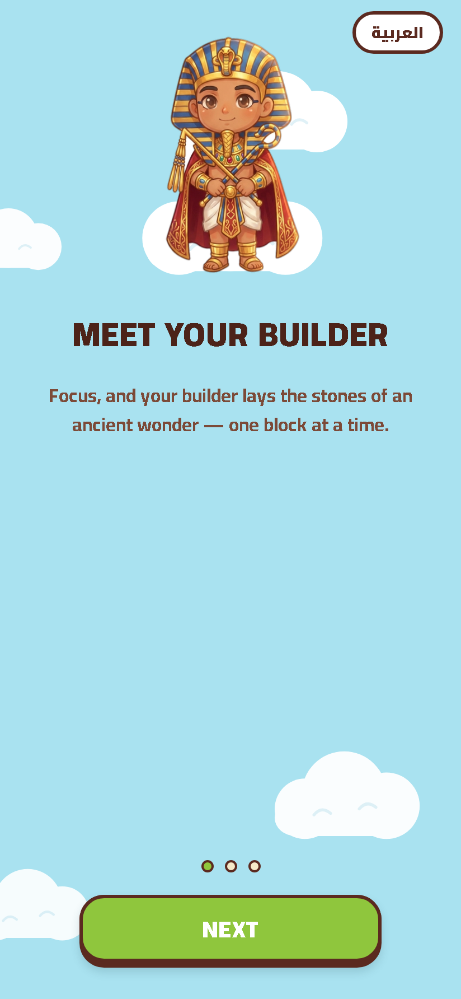
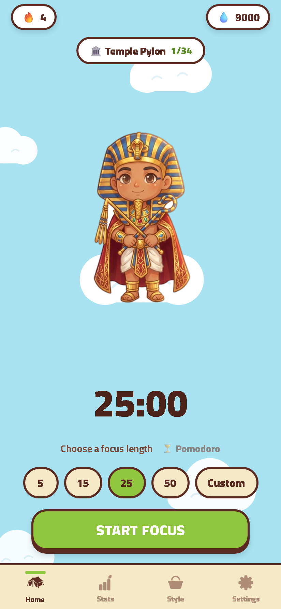
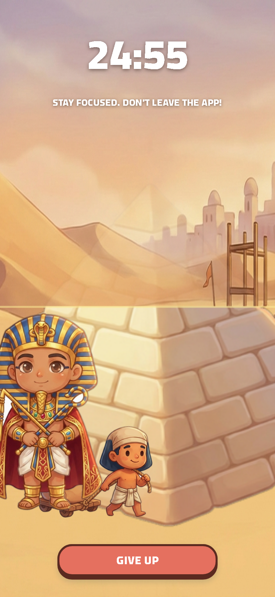
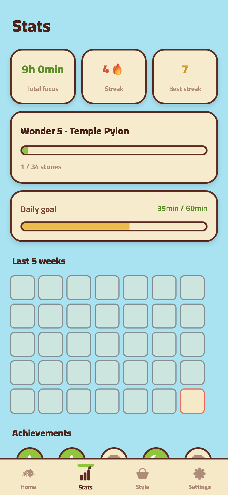
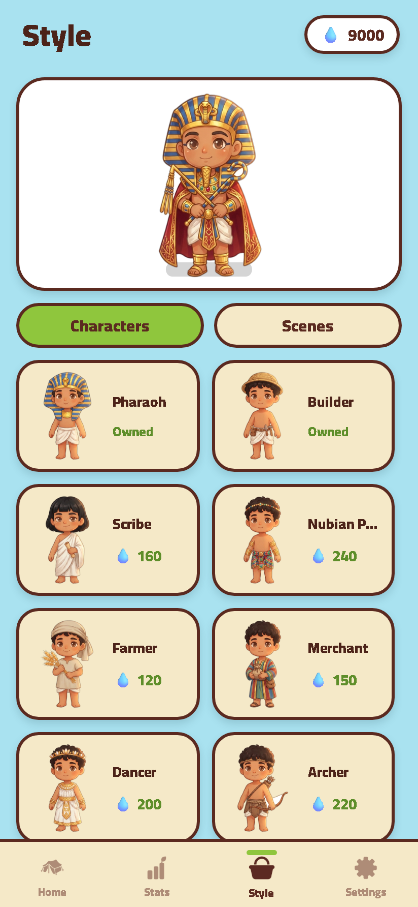
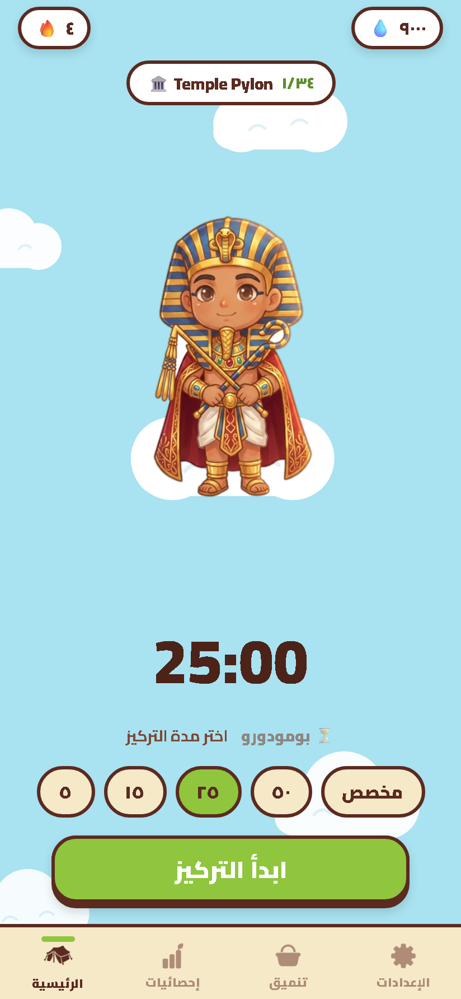

# Tarkeez · تركيز — Build-a-Wonder Focus App

A cozy, Arabic-first focus/productivity app for the MENA region, inspired by *Focus Friend*
(Hank Green). Instead of growing a bean, **you focus to raise an ancient Egyptian wonder
stone by stone** — a customizable chibi pharaoh companion stands by while a little worker
hauls blocks. Every 5 minutes of focus = 1 stone; finish a wonder, start the next.

Built with **React Native + Expo + TypeScript**. Runs on iOS, Android, and web.

| Onboarding | Home | Focus (build) |
|---|---|---|
|  |  |  |

| Stats | Style shop | Arabic (RTL) |
|---|---|---|
|  |  |  |

---

## ⚠️ Read first: Expo Go won't run this (use a dev build)

This project is on **Expo SDK 56** (`react-native` 0.85, `react` 19.2) — newer than what the
App Store / Play Store **Expo Go** ships. So Expo Go shows *"Project is incompatible with this
version of Expo Go."* That's expected, not a bug.

**Web works without any of this** (`npm run web`). To run on a **phone**, build a **dev client**:

- **Local (Mac, recommended for iPhone):** with Xcode installed → `npx expo run:ios`.
  With Android Studio + SDK installed → `npx expo run:android`. This compiles a custom dev
  client straight to the simulator/device; afterwards `npx expo start` loads JS over the LAN.
- **Cloud (no local toolchain):** `npm i -g eas-cli && eas login && eas build --profile development --platform ios` (or `android`). Install the resulting build, then `npx expo start --dev-client`.

> If you'd rather use plain Expo Go, you'd have to downgrade to the latest Expo-Go-supported
> SDK — see `AGENTS.md` (this repo intentionally targets v56).

---

## Getting started (on your Mac)

```bash
git clone https://github.com/uonuon/wonder.git
cd wonder
npm install

npm run web        # open in browser — fastest way to iterate on UI
npm run typecheck  # tsc --noEmit (should be clean)
```

Then for device testing, build a dev client as described above.

---

## Project structure

```
src/
  app/                     # expo-router file-based routes
    _layout.tsx            # root Stack, Cairo font load, portrait lock, device-locale init
    index.tsx              # gate: redirect to /home or /onboarding
    onboarding.tsx         # 3-step intro (meet builder → name → daily goal)
    focus.tsx              # fullscreen LANDSCAPE focus session + countdown + completion
    paywall.tsx            # Tarkeez+ modal (cosmetic — see "Descoped")
    (tabs)/
      _layout.tsx          # custom bottom tab bar
      home.tsx             # clean single page: companion + timer + length chips + Start
      stats.tsx            # totals, streak, daily goal, 5-week heatmap, achievements
      style.tsx            # character + scene shop (buy/equip with "drops")
      settings.tsx         # sound/notifs/haptics, EN/ع, daily goal, reset
  components/
    Companion.tsx          # animated character (3 sine waves + optional shadow + celebrate)
    BuildScene.tsx         # the focus scene: bg + wonder revealed bottom-up + worker + char
    Sky.tsx                # SVG sky backdrop + puffy clouds + CloudBase (Focus-Friend world)
    ui.tsx                 # Txt, Btn (sticker), Card, Toggle, Pill, Icon, ProgressBar
  lib/
    store.ts               # zustand + persist (AsyncStorage) — all state & actions
    wonders.ts             # 8 wonders, stones↔seconds math, progress derivation
    catalog.ts             # characters (20) + scenes (6)
    assets.ts              # require() map + baked image DIM map + aspect() helper
    theme.ts               # colors (C), radii (R), spacing (SP), font, shadow
    i18n.ts                # S strings [en, ar], t(), num() (Arabic-Indic), isRTL(), quotes
assets/
  game/                    # 94 AI-generated PNGs (characters, wonders, scenes, props, icons)
  images/                  # app icon, adaptive icon, splash, favicon (generated — see below)
  fonts/Cairo-Regular.ttf  # carries Latin + Arabic glyphs
scripts/                   # dev harness (see below)
docs/screenshots/          # curated screenshots used in this README
```

---

## Design system (Focus-Friend look)

The UI follows *Focus Friend*'s cozy, gamified style, themed for our pyramid world:
- **Sky world** — soft cyan background with hand-drawn SVG clouds (`Sky.tsx`); the character
  stands on a cloud. No background image assets.
- **Sticker buttons** (`Btn` in `ui.tsx`) — chunky cream/green/coral faces with a thick maroon
  outline and a maroon bottom lip that compresses on press. `kind`: `cream` | `primary`
  (green) | `danger` (coral) | `plain`.
- **Cream cards** with maroon borders; **green pill `Toggle`s** with a cream knob; white
  **`Pill`** counters for streak/drops.
- **Type** — Cairo at three weights (`@expo-google-fonts/cairo`): 400 body, 700 bold, **900
  black** for the chunky marker headings/buttons. Arabic-safe. Tokens live in `lib/theme.ts`
  (`C` palette, `FONT`/`FONT_BOLD`/`FONT_BLACK`, `STROKE`, `R`, `SP`).
- Palette: sky `#A9E2F0`, cream `#F5E9C8`, maroon outline `#5B2A20`, green `#8FC63D`,
  coral `#E5705F`, toggle-on `#C3D85B`.

## How the core works

### Build-a-Wonder math (`src/lib/wonders.ts`)
- `STONE_MINUTES = 5` → **1 stone per 5 focus-minutes** (`stonesFromSeconds`).
- `WONDERS` = 8 monuments, each with a `stones` cost (22 → 60). `progressFor(totalStones)`
  derives `{ idx, wonder, inWonder, needed, frac }`.
- During a session, `focus.tsx` computes a **live fraction** that grows in real time and
  feeds `BuildScene`, which reveals the wonder image **bottom-up** by clipping
  (`overflow:'hidden'` + offset inner `<Image>`), with a faint "ghost" of the finished
  structure and a glowing build-line.

### State (`src/lib/store.ts`)
- `zustand` + `persist` middleware over **AsyncStorage** (key `tarkeez-store`).
- `completeSession(minutes)` updates focus totals, streak (with yesterday/today logic),
  drops/coins, history, and returns `{ dropsEarned, wonderUp, wonderIdx }`.
- Economy: `coins` ("drops") spent in the Style shop; premium items gated behind `plus`.

### i18n / RTL (`src/lib/i18n.ts`)
- `t(key)` returns EN or AR from `S`; `num(n)` renders Arabic-Indic digits; `isRTL()` flips layout.
- **Device-locale auto-detect:** on first launch `_layout.tsx` reads `expo-localization`
  and calls `store.initLocale()` — Arabic devices open in Arabic. A `langPicked` flag
  (set when the user toggles language) ensures a returning user's choice is never overwritten.
  This runs only **after** zustand finishes rehydrating (`persist.onFinishHydration`).

### Companion animation (`src/components/Companion.tsx`)
Three **out-of-phase Reanimated sine waves** (bob / breathe / sway) + a grounding shadow that
pulses with the hover + a celebrate "pop". Reads alive without flipbook frames.
**Rive note:** authoring `.riv` files requires the Rive editor (can't be done from code), so a
Rive runtime is left as a documented drop-in upgrade slot in this file — swap the `<AImage>`
body for `<Rive>` once you author a `.riv`, mapping `celebrate` onto a state-machine input.

### Orientation
The app is **portrait everywhere**; `focus.tsx` locks **landscape** for the immersive build
scene via `expo-screen-orientation` and restores portrait on exit. `app.json` orientation is
`default` so iOS actually permits the per-screen lock.

---

## Dev & asset tooling (`scripts/`)

All run with plain `node` (no build step). Powered by Playwright (a `devDependency`).

| Script | What it does |
|---|---|
| `scripts/shot.mjs <route> <out>` | Screenshot an Expo-web route headlessly; seeds the `tarkeez-store` localStorage so tabs render. `npm run shot -- home shots/home.png`. |
| `scripts/shot-ar.mjs <route> <out>` | Same, but seeds Arabic (`lang:'ar'`) to verify RTL. |
| `scripts/shot-build.mjs` | Seeds a mid-build state to verify the focus scene's stone reveal. |
| `scripts/make-icon.mjs` | Generates `assets/images/{icon,android-icon-foreground,splash-icon,favicon}.png` from the pyramid art using a Playwright SVG-render trick (no `sharp` needed). `npm run icons`. |

**Port gotcha:** the shot scripts default to `http://localhost:8081`. Expo web sometimes
binds a different port — override with `SHOT_BASE`:
```bash
npm run web                 # note the port it prints (e.g. 8082)
SHOT_BASE=http://localhost:8082 npm run shot -- home shots/home.png
```

---

## Architecture decisions & gotchas (so you don't relearn them)

- **No Skia in the build scene.** `@shopify/react-native-skia` is installed but the focus
  scene was rewritten to **pure RN `<Image>` layers** — Skia's web CanvasKit kept throwing
  (`XYWHRect`/CanvasKit-not-loaded). No visual quality lost for layered art.
- **Baked image dimensions.** Web has no `Image.resolveAssetSource`, so aspect ratios are
  hardcoded in the `DIM` map in `lib/assets.ts` (`aspect(name)` helper). If you add art,
  add its `[w,h]` there too.
- **Reanimated 4 needs the worklets babel plugin** — see `babel.config.js`
  (`react-native-worklets/plugin`). Don't remove it.
- **Routing:** the home tab is `(tabs)/home.tsx` (not `index`) to avoid colliding with the
  root `index.tsx` gate at `/`.
- **Assets are static `require()`s** in `lib/assets.ts` (Metro needs literal requires).
- `assets/game/` contains **94** PNGs but only ~40 are wired up; the extras (camel_*, layered
  cosmetics, stone variants) are leftovers from an earlier Godot prototype — free to reuse.

---

## Intentionally descoped (per product scope)

Focus was kept on the **core**: intro/onboarding, companion animation, the build-block
calculations, and the focus loop. These are stubbed/cosmetic and ready to wire up later:

- **RevenueCat / IAP** — `paywall.tsx` + `subscribePlus()` are UI-only (no real billing).
- **Store submission** (App Store / Play) — needs your developer accounts + signing.

**Local notifications ARE wired** (`src/lib/notifications.ts`): a daily focus reminder
(8 PM, bilingual) scheduled via `expo-notifications`. Permission is requested at the end of
onboarding (and from the Settings toggle), re-asserted on launch without prompting, and is a
no-op on web. Only **remote push** is not set up. Note: like the rest of the app this needs a
**dev build** to fire (Expo Go can't run SDK 56).

### Suggested next steps on Mac
1. Build a dev client (`npx expo run:ios`) and run a real start-to-finish session + confirm the
   daily reminder fires.
2. (Optional) Make the reminder time user-configurable (currently fixed at 20:00 in
   `notifications.ts`).
3. (Optional) Author a `.riv` companion in the Rive editor and drop it into `Companion.tsx`.
4. Wire RevenueCat for Tarkeez+ when you're ready to monetize.
5. Add ambient audio (`expo-av` is installed).

---

## Project history & references

This RN app is the second iteration. The history and source material are preserved in-repo:

- **`prototype-godot/`** — the original Tarkeez, built in **Godot 4.7** (now archived/reference).
  All the core logic (state, growth/economy, i18n/RTL, Build-a-Wonder) was prototyped here
  first. See `prototype-godot/PROTOTYPE_NOTES.md`. Build caches / APKs / raw art were left out
  as regenerable; the secret Gemini `.key` is **never** committed (`*.key` is gitignored).
- **`prototype-godot/art_gen/`** — the **art-generation pipeline**: Python scripts that call
  Gemini `gemini-3-pro-image` to generate every PNG, then flood-fill backgrounds to
  transparent and autocrop. Add your own `art_gen/.key` to regenerate/extend art. Details in
  `PROTOTYPE_NOTES.md`.
- **`docs/reference/focus-buddy/`** — 21 reference screenshots of *Focus Friend* (Hank Green),
  the app whose cozy, clean feel we're matching. Design north-star.

### Asset provenance
Every PNG in `assets/game/` (94 files) was generated by the `art_gen/` pipeline above. Only
~40 are currently wired into the app (`lib/assets.ts`); the rest (extra characters, layered
cosmetics, stone/scene variants) are yours to use as you expand. When you add new art, also
add its `[width, height]` to the `DIM` map in `lib/assets.ts`.

## Tech stack

Expo SDK 56 · expo-router · React Native 0.85 · React 19.2 · TypeScript (strict) ·
zustand + AsyncStorage · react-native-reanimated 4 · expo-localization ·
expo-screen-orientation · expo-haptics · Cairo font · Playwright (dev harness).
